# BÀI 1: CÀI WIN SEVER 2016

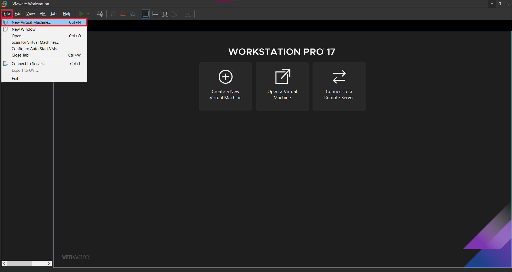


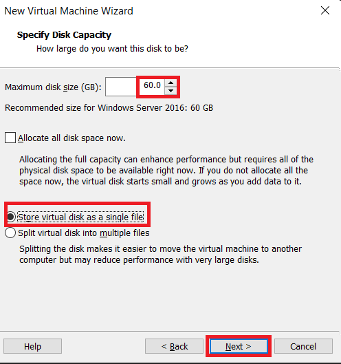


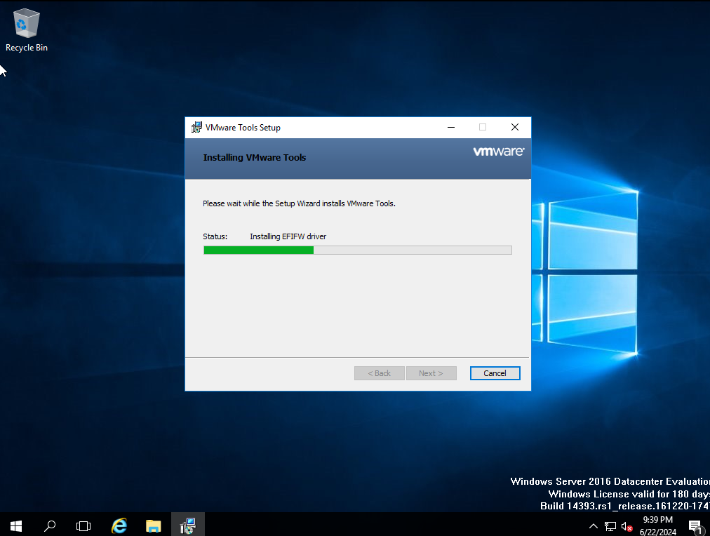


# BÀI 2: CÀI WIN 2010


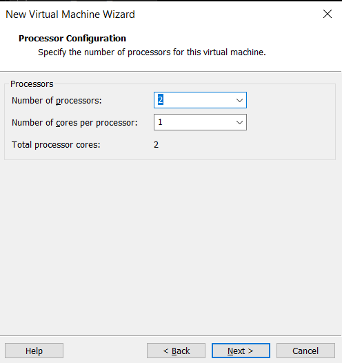


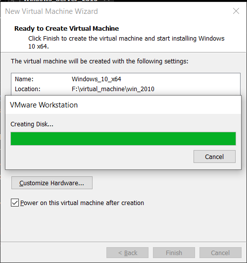

<!--  -->


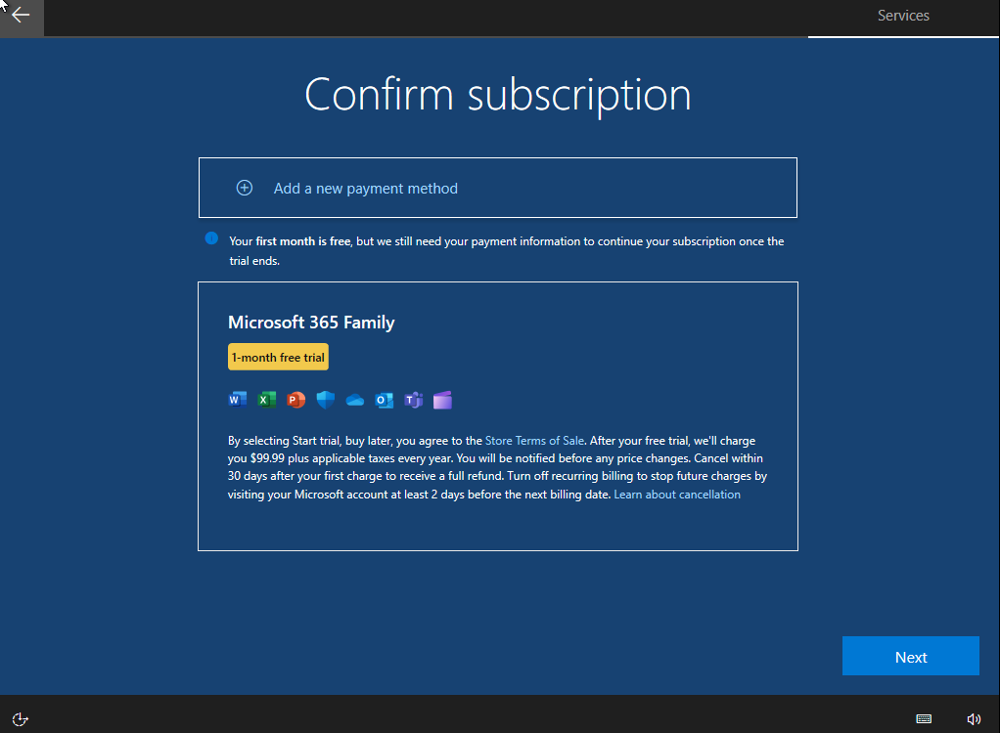


- Thực hiện cài như ở win sever 2016

- Như vậy sau 2 bài này ta sẽ có sever và máy cliet như sau


# BÀI 3: NÂNG CẤP MÁY CHỦ WINDOWS SEVER 2016 LÊN DOMAIN CONTROLLER VÀ JOIN DOMAIN


- `netsh interface show interface`: xem card mạng.

- `netsh interface ip set address name="Ethernet0" static 192.168.1.2 255.255.255.0 192.168.1.1`: định địa chỉ cho card mạng Ethernet.

- `netsh interface ip set dns name="Ethernet0" static 192.168.1.2`: định địa chỉ dns.

    

    

    

    

    

- chúng ta vẫn có thể định địa chỉ bằng tay.

- Thực hiện cài đặt dịch cụ Active Directory Domain Serviece.

    

    

    

    

    

    

    

    

    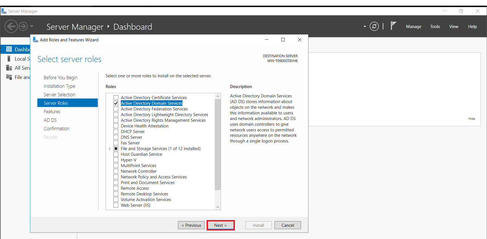

    

    

    

    

    

    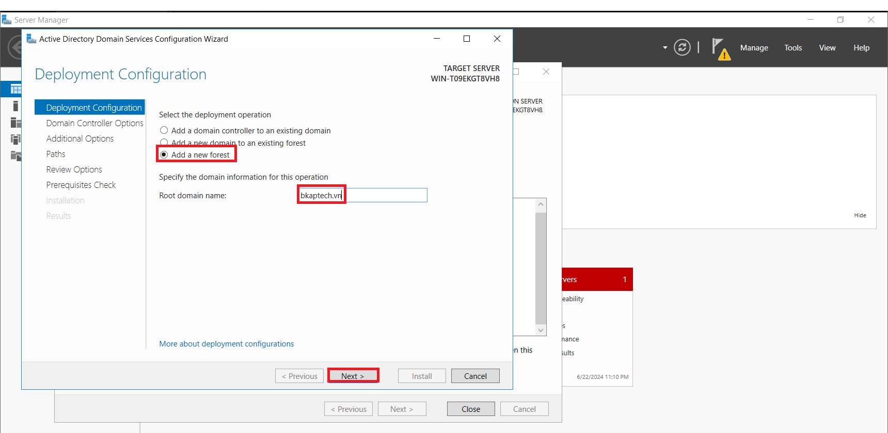
    
    <!--  -->

    

    

    

    

    

    

    

    

    Để kiểm tra máy chủ đã nâng cấp lên **Domain Controller** chưa, vào **Compuer/Properties**.

    

    Kiểm tra, sửa lại địa chỉ card mạng, địa chỉ **DNS Server** phải trùng với địa chỉ IP của máy **Domain Controller**. 

    

- Thực hiện Join máy **Client** vào **Domain**:

    

    

    ```txt
    netsh interface show interface

    netsh interface ip set address name="Ethernet0" static 192.168.1.10 255.255.255.0 192.168.1.1

    netsh interface ip set dns name="Ethernet0" static 192.168.1.2
    ```

    Gõ `network connection` ta kiểm tra:

    

    

    Thực hiện ping từ máy client đên máy sever.

    <!--  -->

    

- Để Join máy **Client** vào **Domain**, vào **This PC/Properties/Change Settings**.

    Vô `Control Panel` và gõ `Control Panel\System and Security\System` ở thanh tìm kiếm

    

    

    

    

    Nếu join thành công thì sẽ hiện:

    

    Sau khi restart lại máy thì kiểm tra xem đã join được chưa.

    

## Phụ:

- `control timedate.cpl`: Kiểm tra giờ và chỉnh.

- `hostname`: để xem tên sever.

- `wmic computersystem where name="%computername%" call rename name="TungDvan"`: đổi tên sever thành TungDvan.

    `shutdown /r /t 0`: reset lại máy.

- `netsh interface set interface name="CurrentName" newname="NewName"`: dổi tên card mạng.

# BÀI 4: CẤU HÌNH CÁC ĐỐI TƯỢNG TRÊN ACTIVE DIRECTORY. 

## Tạo và cấu hình tài khoản trên Domain Controller. 


- Thực hiện trên sever, tạo nhóm và tài khoản người dùng.

    

    Vào dịch vụ **Active Directory User and Computer** để tạo **OU, Group, User**,.

    

    

    - Tiến hành tạo các đối tượng **group**:

        

        hoặc có thể nhấn vô đây:

        

        Tại cửa sổ **New object – Group**, nhập vào tên **Group**. 
        
        - Group scope : Global. 

        - Group Type : Security.

        

        

    - Tiến hành tạo tài khoản người dùng (User):

        

        hoặc có thể nhấn vô đây:

        

        Để tạo User tên là **Nguyen Quoc Hung**, tại cửa sổ **New Object – User**, nhập vào các thông số sau:

        - **First name**: Nguyen Quoc. 

        - **Last name**: Hung. 

        - **Full name**: Nguyen Quoc Hung. 

        - **User logon name**: hungnq (@bkaptech.vn).

        

        Tại cửa sổ tiếp theo, nhập vào mật khẩu (password) của tài khoản `hungnq` (mk: `123456a@`):

        - **User must change password at next logon**: tài khoản phải thay đổi mật khẩu trong lần đăng nhập tiếp theo (khuyển khích bỏ tùy chọn này). 

        - **User cannot change password**: Tài khoản không được thay đổi password (khuyến khích dùng tùy chọn này). 

        - **Password never expires**: Mật khẩu không bao giờ hết hạn (khuyến khích dùng tùy chọn này). 

        - **Account is disabled**: Tài khoản bị khóa (khuyến khích không dùng tùy chọn này).

        

        

        

    - Tiến hành **Add User** vào **Group**:

        - Click chuột phải tại **Group GG_S_GV**, chọn **Properties**.

        - Tại cửa sổ **GG_S_GV** Properties, chuyển sang tab **Members**.

        

        

        

        Nhập vào User cần add vào **Group** (VD: nhập vào User **hungnq@bkaptech.vn**) (click vào **Check Names** khi nhập tên User).

        

        **Add User** vào **Group** thành công !!

        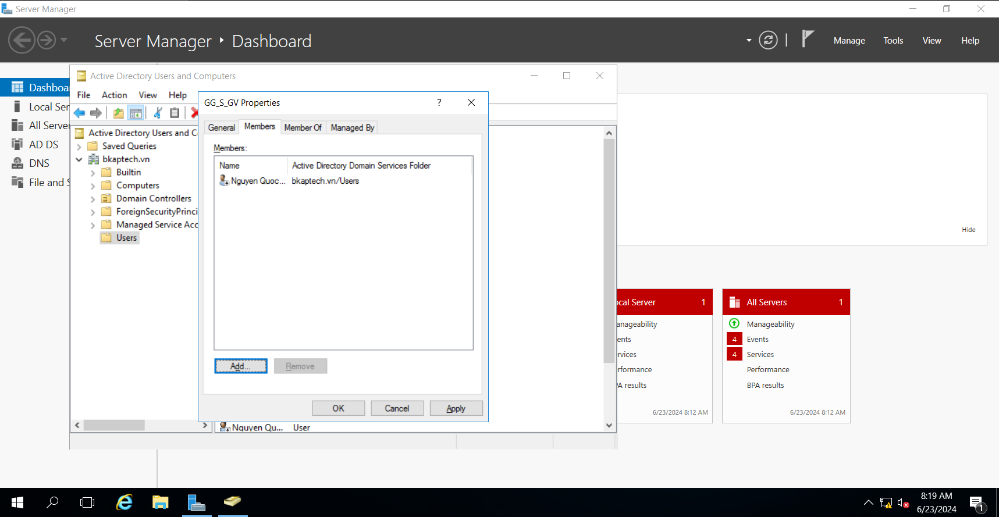

        Nhập thông tin của các thành viên còn lại:

        - Vũ Văn Cường (giảng viên):

            

            

            

        - Nguyễn Quốc Hưng (giảng viên):

            

            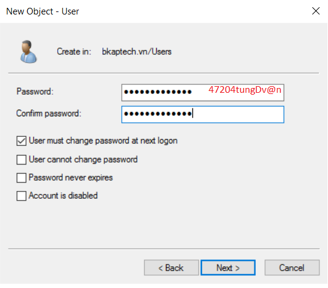

        - Chu Hồng Quân (giảng viên):

            

            

            

        - Nguyễn Hoài Duy (Nhóm giám đốc):

            

            

            

    - Sau khi nhập xong ta sẽ được như sau:

        

    - Thực hiện thêm các giange viên vào group:

        

        

        

        

    - Tất cả các tài khoản người dùng trên là thành viên của nhóm **Backup Operators**.

        

        

        

        

        

        

    - **Thực hiện:** Tài khoản người dùng `duynh` và `cuongvv` phải thay đổi mật khẩu (password) khi đăng nhập vào hệ thống lần đầu tiên. 

        

        

        

        
    
    - **Thực hiện:** Người dùng `quanch` không được phép đổi mật khẩu từ máy trạm. Người dùng `quanch` hết hạn làm việc vào ngày 10/10/2024.

        

        

    - **Thực hiện:** Tạm khóa tài khoản `hungnq` vì người dùng bận việc bên ngoài.

        

        

    - **Thực hiện:** Nhân viên nhóm giảng viên được phép đăng nhập vào mạng từ `7h` sáng đến `9h` tối hàng ngày, từ **thứ 2** đến **thứ 7**. 

        

        <!--  -->

        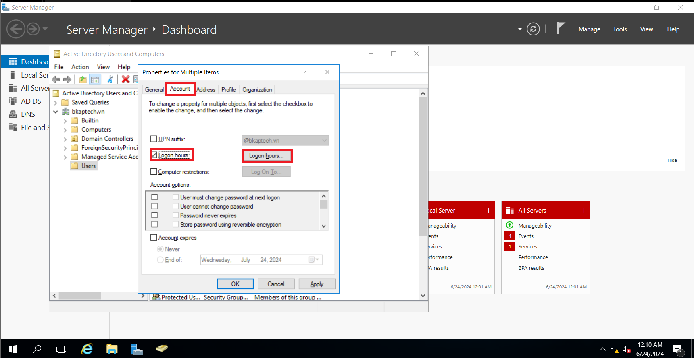

        

        

    - T**hực hiện:** Chuyển qua máy trạm , thực hiện Join máy Client vào Domain, kiểm tra đăng nhập tài khoản.

        

        Đăng nhập tài khoản `duynh` và `cuongvv` để kiểm tra. (**User** phải thay đổi mật khẩu trong lần đăng nhập đầu tiên).

        - Với user `duynh`:

            

            

            

            

            

            

        - Với user `cuongvv`:

            

            

            

            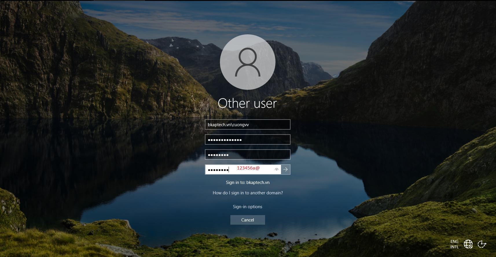

            

        User `hungnq` bị khóa tài khoản do bận việc bên ngoài:

        

        

        

## Tạo OU, Group, User và cấu hình ủy quyền quản trị OU


- Chuẩn bị:

    **Sever:**

    

    **Client:**

    

- Thực hiện trên máy **sever**, tạo **OU, Group, User**:

    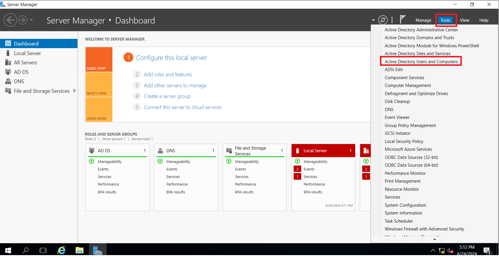

    Tạo **OU HANOI**:

    

    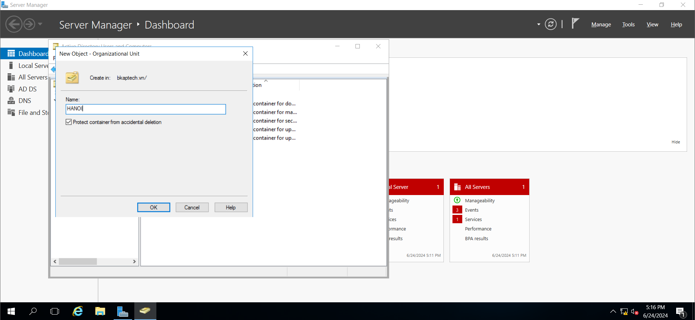

    Tạo **OU Technical** trong **OU HANOI**:

    

    

    Làm tương tự với **Sale** và **Marketing**:

    

    

    

    

    

- Tạo các **Group, User** trong các **OU** tương ứng:

    - Phòng ban **Technical** : Nguyễn Quốc Hưng (`hungnq`) , Chu Hồng Quân (`quanch`) thuộc nhóm **GG_S_Technicals**.

        

        

        

        

        

        

        

        

        

        

        

        Add 2 User `hungnq` và `quanch` vào **Group GG_S_Technicals**:

         

        

        

        

        

        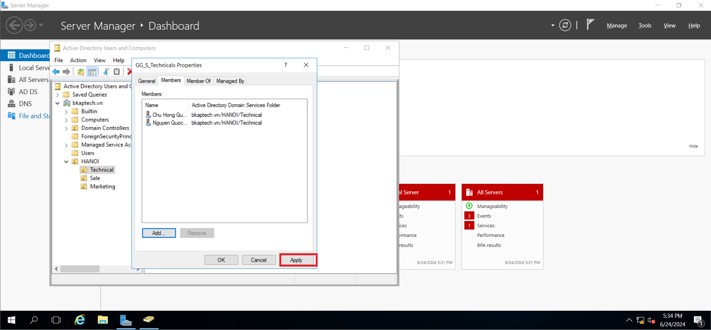

    - Phòng ban **Sale** : Lưu Văn Trưởng (`truonglv`) , Lưu Văn Nghĩa (`nghialv`) thuộc nhóm **GG_S_Sales**.

        Làm tương tự như với phòng trên, kết quả sẽ như sau:

        

        

    - Phòng ban **Marketing**: Nguyễn Tiến Cường (`cuongnt`) thuộc nhóm **GG_S_Marketings**.

        Làm tương tự như với phòng trên, kết quả sẽ như sau:

        

        

- Cấu hình ủy quyền cho tài khoản `hungnq` được phép tạo tài khoản.

    

    

    

    

    

    

    

- Chuyển qua máy **Client**, tiến hành Join máy **Client** vào **Domain**, đăng nhập bằng tài khoản **Administrator** để kiểm tra Join đã thành công chưa.

    

    ***Cài đặt tool*** : **Remote Server Administration Tools Window 10** (tải ở ngoài rùi ném vào máy ảo).

    

    ***Chạy file:***

    

    

    

    

    

    Vào **Start**, tìm `Administrative Tools` để mở chương trình RSAT vừa cài đặt. 

    

    Giao diện của chương trình `RSAT`:

    

    Chuyển qua tài khoản `hungnq` để kiểm tra.

    

    

    

    

- Từ máy Client Windows 8, sử dụng **Remote Server Administration Tools** để đăng nhập tài khoản quản trị `hungnq`, tạo tài khoản Vũ Văn Cường (`cuongvv`) ở phòng ban **Technical**.

    Vào chương trình **RSAT** vừa cài đặt, vào dịch vụ **Active Directory User and Computer.**

    

    Tạo tài khoản Vũ Văn Cường (`cuongvv`) ở phòng ban **Technical**.

    

    Chuyển qua server để kiểm tra. User `cuongvv` đã được đồng bộ sang DC.

    